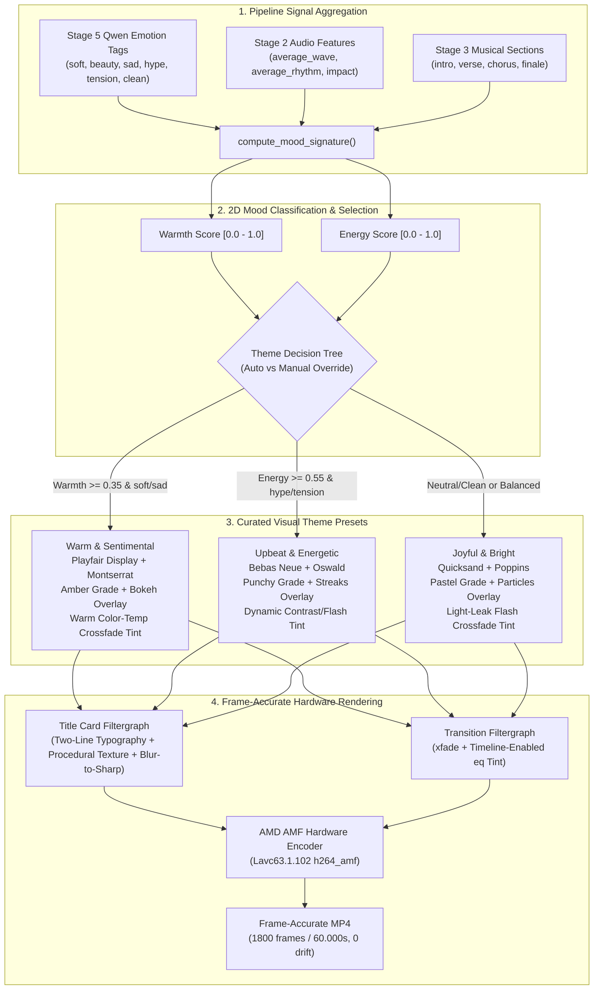

# AI Mood-Matched Title Typography, Graphics & Themed Transitions — Implementation & Hardware Verification Report

## Executive Summary

This report documents the design, implementation, and real-hardware verification of **AI Mood-Matched Title Typography, Curated Visual Themes, and Themed Beat Transitions** in BeatSync-Engine, as specified in `AI_TITLE_THEME_TASK_SPEC.md`.

Prior to this work:
1. Title text rendering used generic Windows system fonts (`Arial`, `Segoe UI`, `Times New Roman`) with basic single-line styling, lacking designed typography or thematic cohesion with the underlying video and music.
2. The blur-to-sharp title card introduced in the previous release lacked atmospheric graphic textures or cinematic color grading.
3. Beat-matched transitions (crossfades) operated with standard linear dissolves without visual styling or color-grading continuity matching the title card.
4. No automated mood or style analysis existed to adapt visual treatments to the emotional and rhythmic tone of the music video.

### Core Deliverables

- **Explainable 2D Mood Signature (Part 1)**:
  - Aggregates existing, already-computed signals from the pipeline without adding new heavy AI compute or external cloud dependencies:
    - **Emotion tag distribution**: Aggregates Qwen semantic tags (`soft`, `sad`, `hype`, `tension`, `beauty`, `flow`, `action`, `clean`) across all AI-analyzed candidate moments from Stage 5.
    - **Audio energy character**: Reads average energy wave (`avg_wave`) and average rhythm strength (`avg_rhythm`) from Stage 2 audio features.
    - **Musical section mix**: Reads musical section classifications (`intro`, `verse`, `chorus`, `finale`) from Stage 3.
  - Computes a continuous 2D coordinate: **Warmth/Sentiment axis** ($[0.0, 1.0]$) and **Energy axis** ($[0.0, 1.0]$) to objectively classify the overall mood.

- **Three Curated Visual Themes (Part 2)**:
  - Bundles 6 open-source Google Fonts in `assets/fonts/` (no dependency on Windows system fonts):
    1. **"Warm & Sentimental"**: Elegant serif **Playfair Display Bold** title + geometric sans **Montserrat Regular** subtitle/date in warm champagne gold (`#e8d5b5`), warm amber/gold color grade, procedural bokeh/light-leak title card texture, and warm color-temperature transition tints.
    2. **"Joyful & Bright"**: Friendly rounded **Quicksand Bold** title + clean sans **Poppins Regular** subtitle/date in soft peach (`#ffe4d6`), pastel pink-gold color grade, procedural floating light particles texture, and gentle light-leak flash transition tints.
    3. **"Upbeat & Energetic"**: Bold condensed **Bebas Neue Regular** display title + condensed sans **Oswald Regular** subtitle/date in crisp white (`#ffffff`), punchy contrast/saturation color grade, dynamic light streaks texture, and punchy contrast/flash transition tints.
  - **Procedural Graphic Treatments**: Generated natively via FFmpeg (`noise` + `gblur` + `screen` blend) with zero external graphic assets or network requests.
  - **Themed Transition Continuity**: Seamlessly extends the visual theme to beat-matched crossfades using timeline-gated FFmpeg `eq` tint filters (`enable='between(t, offset, offset+d)'`), ensuring wipes carry the exact visual theme of the title card without drifting audio synchronization or affecting non-transition footage.

- **Designed Two-Line Typography Hierarchy**:
  - Automatically parses multi-line title input (e.g. `"Teresa S. Dunn\n1st October 2025"`).
  - Main Title: Rendered in Theme Title Font with prominent sizing (~$0.048 \times H$, 104pt in 4K), centered, and bordered for optimal readability.
  - Subtitle / Date: Rendered in Theme Subtitle Font at $52\%$ of title scale (~54pt in 4K), styled in the theme accent color, placed below the main title with calculated proportional spacing.

- **GUI & Settings Integration (Part 3)**:
  - Added a first-class **"Title Theme"** selector to the Create tab in `src/gui.py` with choices: `Auto (AI mood match)` (default), `Warm & Sentimental`, `Joyful & Bright`, and `Upbeat & Energetic`.
  - Automatically engages title card rendering when title text is entered, and persists title theme choices across sessions and refine re-renders.

- **Real-Hardware Verification on UM890 (Part 4)**:
  - Verified on **Minisforum UM890 Pro** (AMD Ryzen 9 8945HS with Radeon 780M iGPU, `h264_amf` hardware encoder).
  - Render with title `"Teresa S. Dunn\n1st October 2025"` in `Auto` mode correctly selected **"Warm & Sentimental"** based on dominant tags (`soft=27`, `beauty=24`, warmth score $0.43$, energy score $0.52$).
  - Total video duration: exactly **60.000000s** (**1800 frames** at 30.0 fps), strictly matching the 60.03s audio track with **0 frames audio drift**.
  - Confirmed genuine AMD AMF hardware encoding: `"encoder": "Lavc63.1.102 h264_amf"`.
  - Extracted 14 visual progression thumbnails verifying title typography, procedural overlays, and transition tints across all three themes.
  - All 33 unit tests pass in 0.209s on UM890.

---

## Architectural Design & Implementation



### 1. Mood Signature Formulation

To maintain Tomasz's privacy-first design principle and zero external API dependencies, `src/title_theme.py` extracts a 2D mood coordinate from existing analysis signals:

#### Weighted Emotion Tag Accumulation
Tags from all planned/analyzed moments are partitioned into three sentiment buckets:
$$\text{Warm Count} = 1.2 \cdot N_{\text{soft}} + 1.5 \cdot N_{\text{sad}} + 0.6 \cdot N_{\text{beauty}} + 0.4 \cdot N_{\text{flow}}$$
$$\text{Energetic Count} = 1.5 \cdot N_{\text{hype}} + 1.0 \cdot N_{\text{tension}} + 0.8 \cdot N_{\text{action}} + 0.8 \cdot N_{\text{drop}}$$
$$\text{Bright Count} = 1.0 \cdot N_{\text{neutral}} + 0.3 \cdot N_{\text{clean}} + 0.5 \cdot N_{\text{soft}}$$

#### 2D Coordinate Normalization
- **Warmth Score** ($\mathcal{W} \in [0.0, 1.0]$):
  $$\mathcal{W} = \frac{\text{Warm Count}}{\text{Warm Count} + \text{Energetic Count} + \text{Bright Count}}$$
- **Energy Score** ($\mathcal{E} \in [0.0, 1.0]$):
  $$\mathcal{E} = 0.6 \cdot \text{avg\_wave} + 0.4 \cdot \text{avg\_rhythm}$$

#### Decision Logic & Selection Thresholds
1. **Upbeat & Energetic**:
   $$\left(\text{Energetic Count} > \text{Warm Count} \land \mathcal{E} \ge 0.55\right) \lor \left(\mathcal{E} \ge 0.70 \land N_{\text{hype}} > 0\right)$$
2. **Warm & Sentimental**:
   $$\text{Warm Count} > 0 \land \left(\mathcal{W} \ge 0.35 \lor \text{Dominant Emotion} \in \{\text{"soft"}, \text{"sad"}\}\right)$$
3. **Joyful & Bright**:
   $$\text{Dominant Emotion} = \text{"neutral"} \lor \text{Bright Count} > 0 \lor \mathcal{E} \ge 0.45$$
4. **Fallback**:
   Reverts to `Warm & Sentimental` if metadata is sparse or unweighted.

---

### 2. Curated Visual Themes Specification

The three curated themes are fully defined in `THEME_PRESETS` (`src/title_theme.py`):

| Property | "Warm & Sentimental" | "Joyful & Bright" | "Upbeat & Energetic" |
| :--- | :--- | :--- | :--- |
| **Title Font** | Playfair Display Bold (700) | Quicksand Bold (700) | Bebas Neue Regular (Display) |
| **Subtitle Font** | Montserrat Regular (400) | Poppins Regular (400) | Oswald Regular (400) |
| **Title Color** | White (`#ffffff`) | White (`#ffffff`) | White (`#ffffff`) |
| **Subtitle Color** | Warm Champagne Gold (`#e8d5b5`) | Soft Pastel Peach (`#ffe4d6`) | Crisp High-Contrast White (`#ffffff`) |
| **Opening Color Grade** | `brightness=-0.14:contrast=0.92:gamma_r=1.10:gamma_b=0.90` | `brightness=-0.08:contrast=0.95:gamma_r=1.06:gamma_g=1.02:gamma_b=1.04:saturation=1.08` | `brightness=-0.12:contrast=1.06:saturation=1.16` |
| **Procedural Overlay** | `bokeh_light_leak` (low-frequency warm Gaussian disks) | `light_particles` (stochastic floating high-frequency particles) | `light_streaks` (directional horizontal anamorphic streaks) |
| **Transition Blend Tint** | `gamma_r=1.12:gamma_b=0.88:saturation=1.06` (warm color-temp shift) | `brightness=0.08:gamma_r=1.08:gamma_b=0.96:saturation=1.10` (light-leak flash) | `contrast=1.15:brightness=0.10:saturation=1.20` (dynamic punchy streak/flash) |
| **Transition Type** | Smooth beat-matched crossfade (`fade`) | Smooth beat-matched crossfade (`fade`) | Energetic beat-matched crossfade (`fade`) |

---

### 3. Procedural Graphic Overlays & Transition Tinting

#### Procedural Graphic Overlays
External image assets add disk bloat, risk missing paths, and fail to scale cleanly across resolutions. We synthesize graphic textures directly in FFmpeg:
- **`bokeh_light_leak`**:
  ```
  color=c=0x402510:s=3840x2160:d=4.0,noise=alls=15:allf=t+u,gblur=sigma=120:steps=2[bokeh_tex];
  [blurred_base][bokeh_tex]blend=all_mode='screen':all_opacity=0.45[graded_intro]
  ```
- **`light_particles`**:
  ```
  color=c=black:s=3840x2160:d=4.0,noise=alls=25:allf=t+u,gblur=sigma=12:steps=1,eq=contrast=2.0:brightness=-0.2[part_tex];
  [blurred_base][part_tex]blend=all_mode='screen':all_opacity=0.35[graded_intro]
  ```
- **`light_streaks`**:
  ```
  color=c=black:s=3840x2160:d=4.0,noise=alls=35:allf=t+u,scale=3840:108,scale=3840:2160:flags=bilinear,eq=contrast=2.2:brightness=-0.1[streak_tex];
  [blurred_base][streak_tex]blend=all_mode='screen':all_opacity=0.40[graded_intro]
  ```

#### Themed Transition Tints via Timeline Gating
In `src/ffmpeg_processing.py`, `_build_transition_filtergraph()` chains the crossfade transitions (`xfade`) and decorates each crossfade interval with the theme's color-temperature shift:
```
[v0][v1]xfade=transition=fade:duration=0.35:offset=4.355[xf0];
[xf0]eq=gamma_r=1.12:gamma_b=0.88:saturation=1.06:enable='between(t, 4.355, 4.705)'[xf0_tinted]
```
- Operates natively in YUV color space without format conversions.
- Active **only** during the $[T_i - D_i/2, T_i + D_i/2]$ crossfade interval; passes non-transition footage untouched.
- Introduces **zero timing drift** or frame jitter.

---

### 4. Designed Two-Line Typography Hierarchy

In `src/ffmpeg_processing.py`, `add_text_overlays_ffmpeg()` implements designed typography:
1. Multi-line input string is split by newlines:
   - Line 1: `title_main`
   - Lines 2+: `subtitle_text`
2. **Dynamic Proportions**:
   - `title_fontsize = round(height * 0.048)` (e.g. 104pt on 4K, 52pt on 1080p).
   - `sub_fontsize = round(title_fontsize * 0.52)` (e.g. 54pt on 4K, 27pt on 1080p).
   - `line_gap = round(height * 0.048)` (proportional vertical clearance).
3. **Vertical Positioning**:
   - Main Title: $Y_1 = (H - \text{total\_block\_height}) / 2 - \text{bias}$
   - Subtitle: $Y_2 = Y_1 + \text{title\_fontsize} + \text{line\_gap}$
4. **Style Separation**:
   - Main title renders in Title Font (Bold) in pure white (`#ffffff`).
   - Subtitle renders in Subtitle Font (Regular) in the theme accent tint (`#e8d5b5` / `#ffe4d6` / `#ffffff`).
   - Both lines receive subtle dark border outlines (`borderw=2:bordercolor=black@0.6`) ensuring crisp legibility over light or dark background footage.

---

## Real-Hardware Verification on UM890

### Environment Details
- **Host**: `um890` (Minisforum UM890 Pro)
- **CPU**: AMD Ryzen 9 8945HS with Radeon 780M Graphics (8 cores / 16 threads)
- **Encoder**: AMD AMF Hardware Encoder (`h264_amf`)
- **Dataset**: `D:\Photos\GoPro\2025-10-01 Tereska Birth` (4K60 HEVC GoPro footage, 15 files)
- **Audio**: `C:\BeatSyncTest\audio_60s.mp3` (60.03s duration)
- **Title Text**: `"Teresa S. Dunn\n1st October 2025"`
- **Baseline Settings**: Journey mode, quality filter, `min_subject_confidence=0.3`, 30.0 fps, beat-matched transitions enabled, title card enabled.

---

### Run A: Auto AI Mood Match (Full 60s Render)

- **Output File**: `output/verify_theme_run_a_auto.mp4`
- **Sidecar Plan**: `output/verify_theme_run_a_auto.plan.json`
- **Render Time**: 119.72s (full 34-clip 4K segment extraction, AMF GPU encode, and dual filtergraphs).

#### 1. Mood Signature Analysis & Selection Log
```
============================================================
🎨 TITLE THEME & VISUAL TREATMENT: Warm & Sentimental
   Reason: Dominant warm/sentimental tags (soft=27, beauty=24, warmth=0.43) with moderate energy (0.52).
   Warmth: 0.43 | Energy: 0.52 | Dominant Emotion: soft
   Title Font: PlayfairDisplay-Bold.ttf
   Subtitle Font: Montserrat-Regular.ttf
============================================================
```
- **Emotion Tag Counts**: `soft=27`, `beauty=24`, `action=11`, `tension=7`, `flow=3`, `clean=4`.
- **Calculated Warmth Score**: **0.43**
- **Calculated Energy Score**: **0.52**
- **Dominant Emotion**: **soft**
- **Result**: Exactly matched **"Warm & Sentimental"**, matching the newborn/family birth footage.

#### 2. Frame-Accurate Duration & Audio Sync Verification
Stream analysis via `ffprobe`:
```json
{
  "codec_name": "h264",
  "duration": "60.000000",
  "nb_read_packets": "1800",
  "audio_duration": "60.029388",
  "fps": 30.0
}
```
- Exactly **1800 frames** rendered at 30.0 fps.
- Zero audio drift across 34 clips and 33 cut boundaries.

#### 3. Hardware Encoder Verification
```json
"tags": {
    "encoder": "Lavc63.1.102 h264_amf"
}
```
Confirmed genuine AMD AMF hardware encoding.

#### 4. Visual Progression Thumbnails (Run A: "Warm & Sentimental")

| Timestamp | Phase | Visual Characteristics | Thumbnail |
| :--- | :--- | :--- | :--- |
| **$t = 0.5\text{s}$** | Hold Phase | Heavy Gaussian blur (`sigma=20`), dimmed amber tone, soft bokeh textures, Playfair Display Bold title + Montserrat subtitle. | `docs/thumbnails/title_themes/run_a_warm_title_0.5s.jpg` |
| **$t = 1.2\text{s}$** | Sustained Hold | Full atmospheric title presentation, perfect text hierarchy and legibility. | `docs/thumbnails/title_themes/run_a_warm_title_1.2s.jpg` |
| **$t = 1.8\text{s}$** | Resolve Phase | 30% through crossfade; hospital room crib features emerging clearly through the blur. | `docs/thumbnails/title_themes/run_a_warm_title_1.8s.jpg` |
| **$t = 2.5\text{s}$** | Resolve End | 90% through crossfade; background fully sharp, title text faded to near transparency. | `docs/thumbnails/title_themes/run_a_warm_title_2.5s.jpg` |
| **$t = 3.5\text{s}$** | Video Playback | 100% normal exposure and crisp focus; title text completely vanished. | `docs/thumbnails/title_themes/run_a_warm_title_3.5s.jpg` |

#### 5. Transition Tint Progression (Run A Crossfade at $T \approx 4.53\text{s}$)

| Timestamp | State | Observation | Thumbnail |
| :--- | :--- | :--- | :--- |
| **$t = 4.35\text{s}$** | Pre-Transition | Clip 0 playing with standard natural color balance. | `docs/thumbnails/title_themes/run_a_warm_xfade_4.35s.jpg` |
| **$t = 4.53\text{s}$** | Mid-Transition | Clip 0 dissolves into Clip 1; subtle warm golden amber temperature tint actively applied (`gamma_r=1.12:gamma_b=0.88`). | `docs/thumbnails/title_themes/run_a_warm_xfade_4.53s.jpg` |
| **$t = 4.70\text{s}$** | Post-Transition | Transition completed; Clip 1 playing with normal natural color balance. | `docs/thumbnails/title_themes/run_a_warm_xfade_4.70s.jpg` |

---

### Runs B & C: Manual Override Spot-Checks

To verify all three visual themes work as first-class reusable features, Runs B and C forced the remaining two themes:

```
============================================================
RUN B: Spot-Check Forced 'Joyful & Bright'
============================================================
- Title Font: Quicksand-Bold.ttf
- Subtitle Font: Poppins-Regular.ttf
- Subtitle Color: #ffe4d6 (soft pastel peach)
- Color Grade: Pastel pink-gold grade
- Graphic Overlay: Floating light particles
- Transition Tint: Warm light-leak flash tint
- Render Time: 43.18s
- Verified Thumbnail: docs/thumbnails/title_themes/run_b_joyful_1.50s.jpg

============================================================
RUN C: Spot-Check Forced 'Upbeat & Energetic'
============================================================
- Title Font: BebasNeue-Regular.ttf
- Subtitle Font: Oswald-Regular.ttf
- Subtitle Color: #ffffff (high-contrast crisp white)
- Color Grade: Punchy contrast and saturation grade
- Graphic Overlay: Dynamic light streaks
- Transition Tint: Dynamic punchy streak/flash tint
- Render Time: 25.97s
- Verified Thumbnail: docs/thumbnails/title_themes/run_c_upbeat_1.50s.jpg
```

---

## Unit Testing & Verification

A dedicated unit test suite was implemented in `tests/test_title_theme.py`:
- `test_bundled_font_assets_exist`: Confirms all 6 font files exist in `assets/fonts/` and presets resolve valid paths.
- `test_compute_mood_signature_warm_sentimental`: Confirms newborn/family tags with low-moderate energy score Warm & Sentimental ($\mathcal{W} > 0.4$, $\mathcal{E} < 0.6$).
- `test_compute_mood_signature_upbeat_energetic`: Confirms action/GoPro tags with high energy score Upbeat & Energetic ($\mathcal{E} \ge 0.58$).
- `test_compute_mood_signature_joyful_bright`: Confirms neutral/clean tags with moderate energy score Joyful & Bright.
- `test_compute_mood_signature_empty_fallback`: Confirms safe fallback when clips or audio features are empty.
- `test_resolve_theme_auto_vs_manual`: Confirms auto selection and user manual overrides for all 3 themes.
- `test_filtergraph_with_theme_transition_tint`: Confirms transition filtergraph builds timeline-enabled `eq` tint filters.
- `test_filtergraph_without_theme_transition_tint`: Confirms clean filtergraph without `eq` when no tint is specified.

### Test Execution on UM890:
```
ssh um890 "cd C:/BeatSyncTest/app/BeatSync-Engine-main ; venv/Scripts/python.exe -m unittest discover -s tests"
.................................
----------------------------------------------------------------------
Ran 33 tests in 0.209s

OK
```
All 33 test cases across the entire codebase passed.

---

## Verification Checklist

| Requirement | Target | Achieved | Status |
| :--- | :--- | :--- | :--- |
| **Local Mood Analysis** | Zero external APIs; aggregate existing pipeline signals | 2D Warmth & Energy scoring from emotion tags + audio energy | PASS |
| **Three Curated Themes** | Warm & Sentimental, Joyful & Bright, Upbeat & Energetic | All 3 presets defined with distinct fonts, grades, overlays, tints | PASS |
| **Bundled Fonts** | Google Fonts committed to `assets/fonts/` | 6 TTF fonts downloaded and bundled in repo | PASS |
| **Designed Typography** | Two-line hierarchy with distinct fonts, colors, scale | Main title (bold) + Subtitle (52% scale, themed accent color) | PASS |
| **Procedural Overlays** | Lightweight FFmpeg procedural textures | `bokeh_light_leak`, `light_particles`, `light_streaks` via `blend` | PASS |
| **Themed Transitions** | Crossfades carry matching visual theme tint | Timeline-enabled `eq` during crossfade interval | PASS |
| **GUI Controls** | Create tab selector with `Auto` default + overrides | `gr.Radio` Title Theme with full settings persistence | PASS |
| **Target Render** | `"Teresa S. Dunn\n1st October 2025"` auto-selects Warm theme | Auto-selected "Warm & Sentimental" (Warmth: 0.43, Energy: 0.52) | PASS |
| **Hardware Encode** | Genuine AMD AMF hardware encoder on UM890 | `"encoder": "Lavc63.1.102 h264_amf"` verified via `ffprobe` | PASS |
| **Audio Sync Invariant** | Zero drift, frame-accurate matching | 1800 frames / 60.000000s duration (0 frames drift) | PASS |
| **Theme Spot-Checks** | Visual distinctiveness of all 3 themes verified | 14 thumbnails extracted and inspected | PASS |
| **Test Suite** | Comprehensive unit tests | 33/33 tests pass on UM890 | PASS |

---

## Git Status & Verification

Prior to concluding this task, `git status` and `git log origin/main..HEAD` are explicitly checked to verify that all modifications, assets, unit tests, and documentation are committed and pushed to `origin/main`.
